# Widget Extension

Hi, if you have landed in this page is because you want to be more productive improving the reusability of your code.

The idea of this widget extension is to create a widget that is totally blackboxed.

## How we have been working till now:
- Stuff that was packaged together with the widget:
	- Templates
	- Controllers
	- Directives used only in that widget.
	- Scaffolding Styles
- Stuff that was used as a module:
	- Services
	- Common Directives
- Module Dependencies are added in widget code.


## Issues of working till now:
- Is difficult to change the templates used in the widget.
- Controllers are blackboxed and can not be extended.
- Directives that were used only in one widget and that after some time are needed in a different widget ...
	- Best case:
		- It will require some refactoring.
			- Remove it from the widget.
			- Move that directive to an existing module or create a module just to keep it reusable.
	- Worst case:
		- It's just copied and pasted in the other widget.
- Scaffolding Styles never can be reused.
- If a new dependency is required, the widget code should be modified so it's never blackboxed.

```
Managing all this together requires do some changes in the way we work.
```

## What we want:
- Never again touch the code of widgets once they have been released.
- Make easier change/extend behaviour.
- Make easier change/extend view.
- See at one sight what are the dependencies of my widget.
- Do it as framework agnostic as possible.

## How we want to do that:
- Dependencies are setup in the model.xml.
- Main module and templates are setup in the model.xml.
- Use modules to store:
	- Behaviour - JS files
	- View - HTML files
	- Styles - CSS files
- Changing the used module allows to change easily from AngularJS to a different framework with too much effort.
	
### Base Widget:
Base widget is pretty much a simple widget but with the responsability of:

- Fetching the dependencies.
- Setup the main template.
- Instanciate the module.

### Widget:
What widget requires:

- Give a name to the module.
- Create a model.xml 
- An index.html with a ng-include directive that will load the template.

## Run example:

For developing locally without portal:

- If you have not done it already, you should install [bb-lp-cli](https://github.com/Backbase/bb-lp-cli) tooling.
- Execute ``bblp start``
- Open [http://localhost:3000](http://localhost:3000)
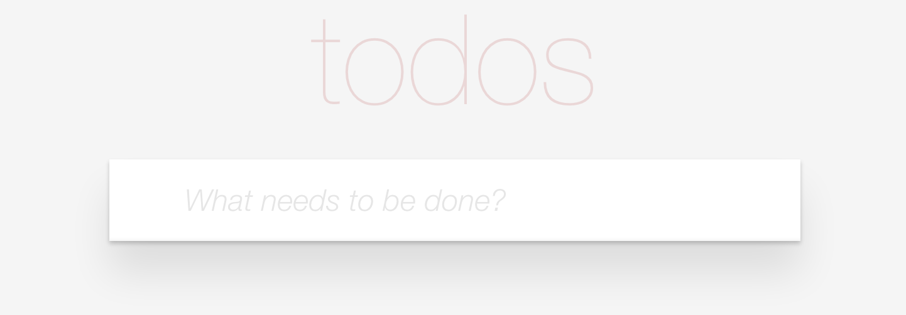
- Type the title of your task.
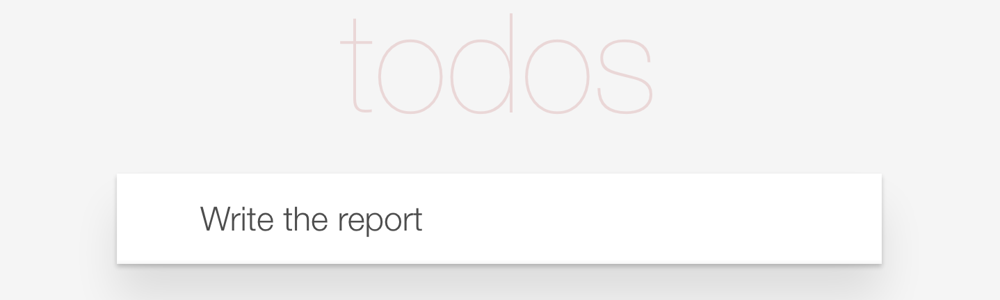
- Press ENTER key.
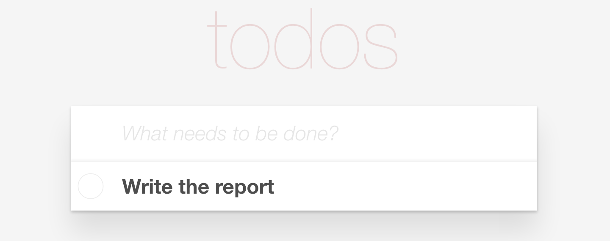
- Double click in the title to edit.
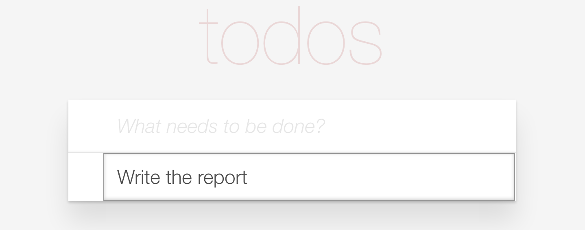
- Modify the title.
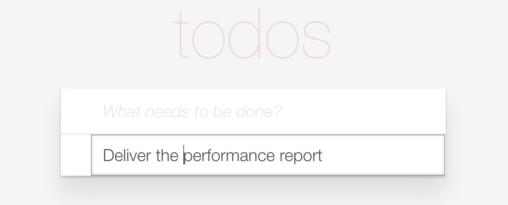
- Press ENTER key.
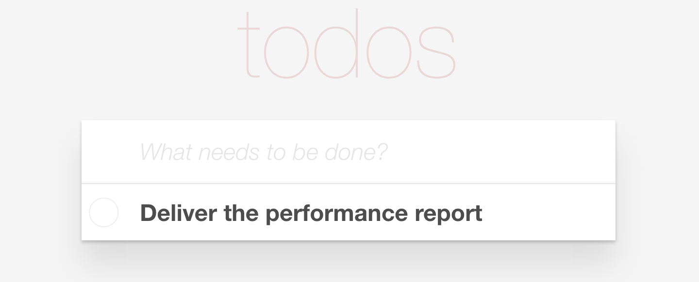
- Do/Undo clicking in the button before the title.
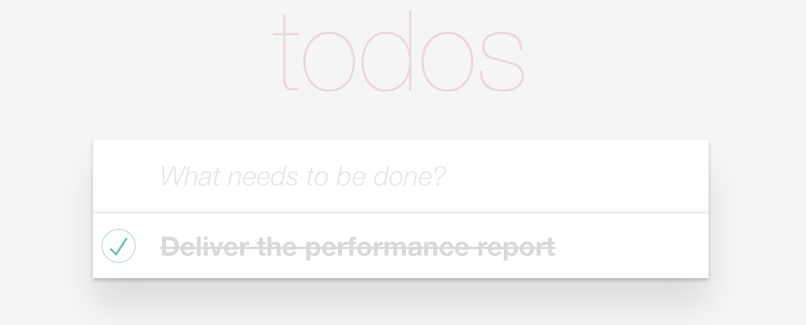
- Move the mouse over the task to show the button to remove the task.
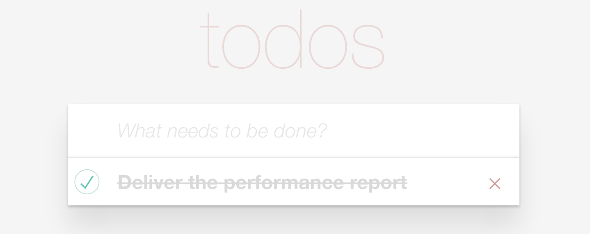
- Remove a task clicking in the button after the title.


### Add more features extending the logic and changing the view.
- Open the model.xml file.
- Change the property name ```deps:module-todo``` to ```deps:module-todo-extended```
- Reload the page and see what has changed.
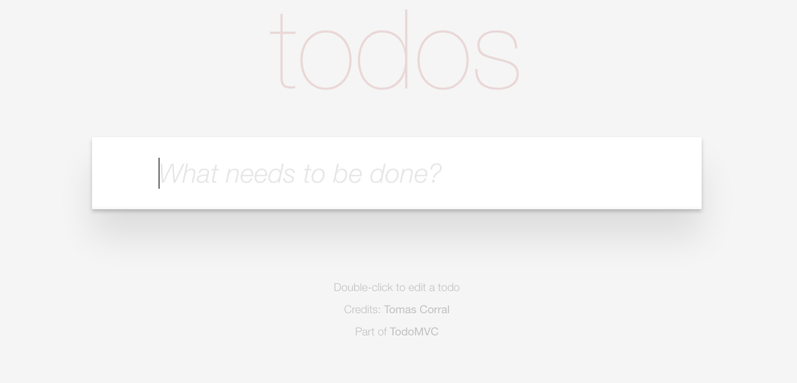
- Type the title of your task.
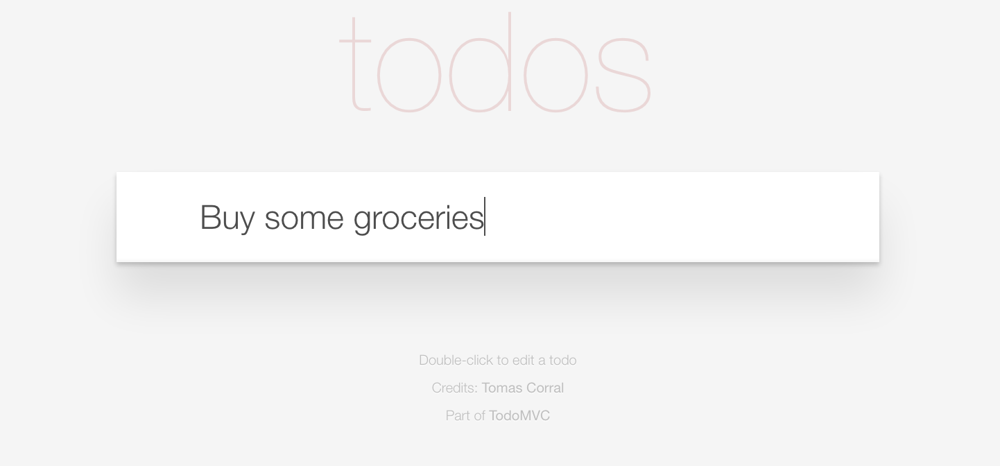
- Press ENTER key.

- Now you can also filter using those new links.
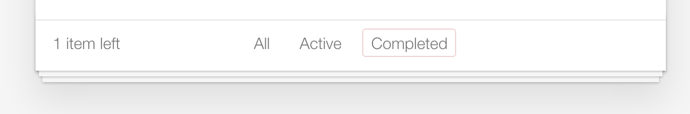
- Click on them to see how the content is hidden or shown depending the status of the task.
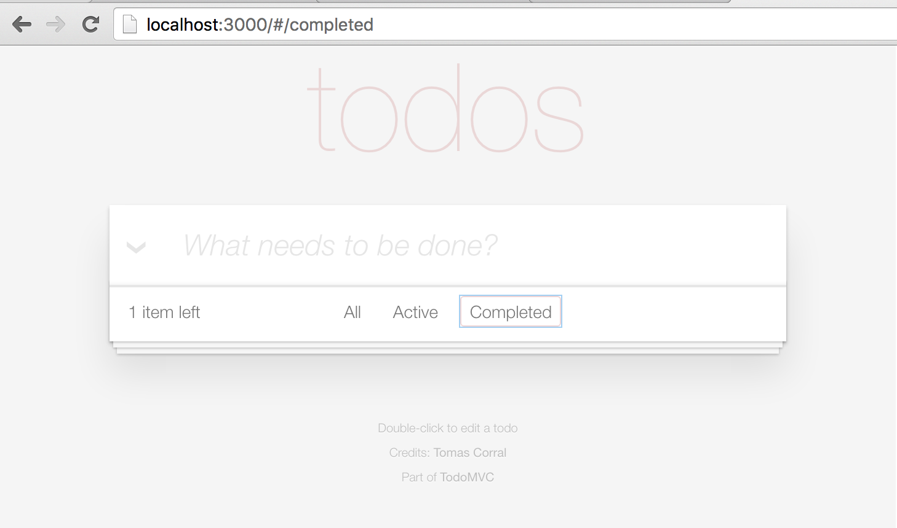
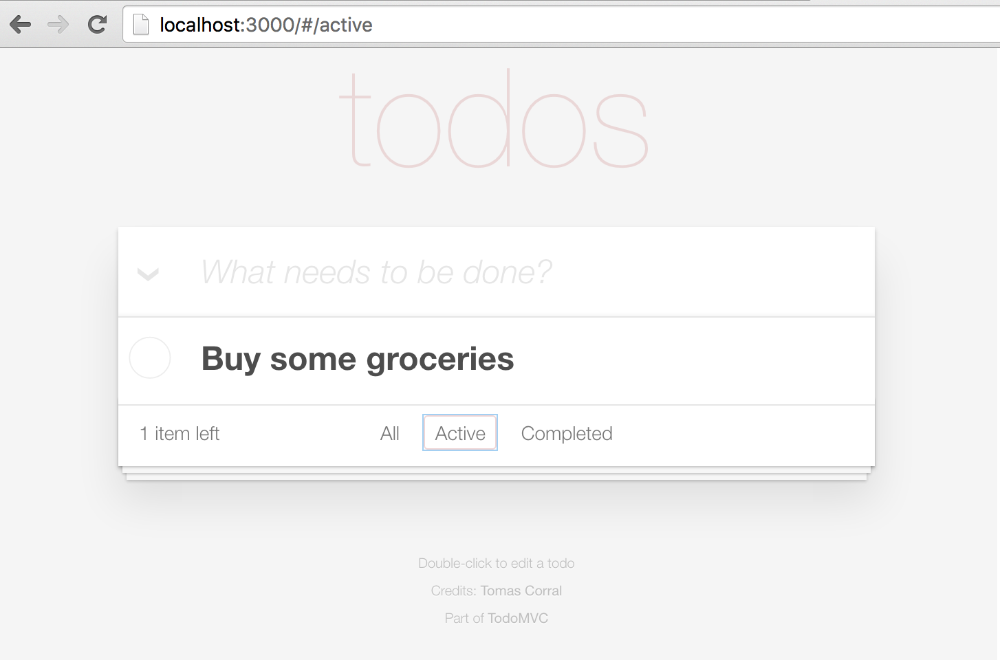
- Do the task clicking the button before the title while filtering by active tasks and see how it dissapears.
- Click in the button that appears inside of the input to toggle all the tasks.
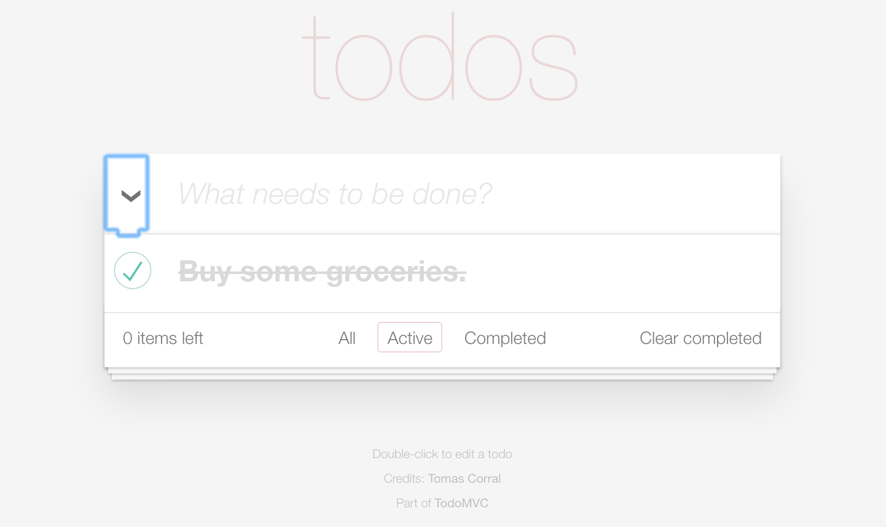
- Mark as done one or more tasks 
- Click in the *Clear Completed* link to see how they are removed from the list.
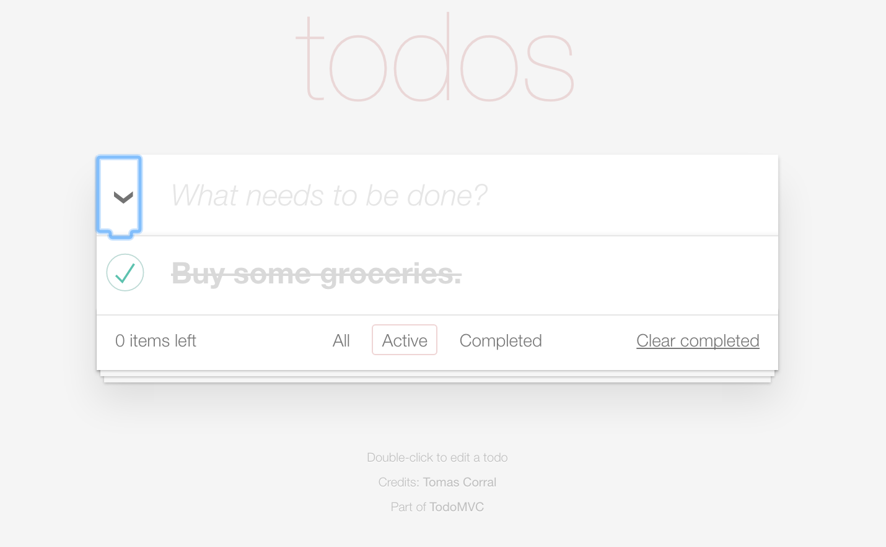


### Change the styling.
- Open ```scripts/base.less```
- Change the content:
 - Before:
 ```
 @import '../bower_components/module-todo/styles/base';
 ```
 - After:
 ```
 @import '../bower_components/module-todo-extended/styles/base';
 ```
- You can see how it changes:
  - Before:
  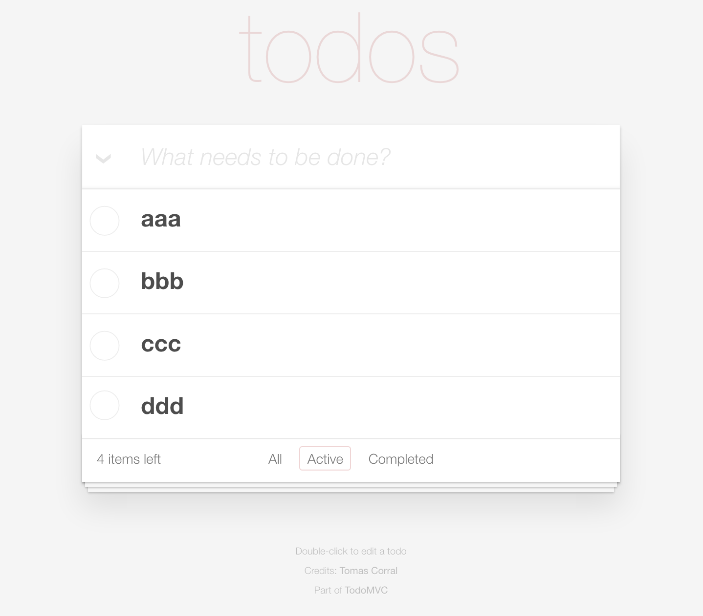
  - After:
  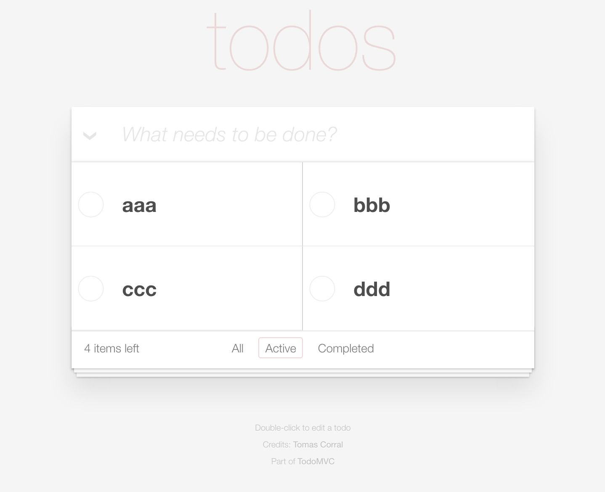


For developing using portal:

- Requires to import modules
- Requires to execute ```bb import-item``` each time you modify the model.xml or use ```bb import-item -W``` to import it on each code change.


Enjoy it!
