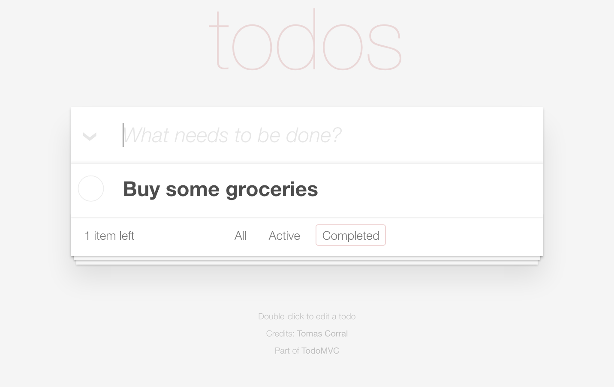
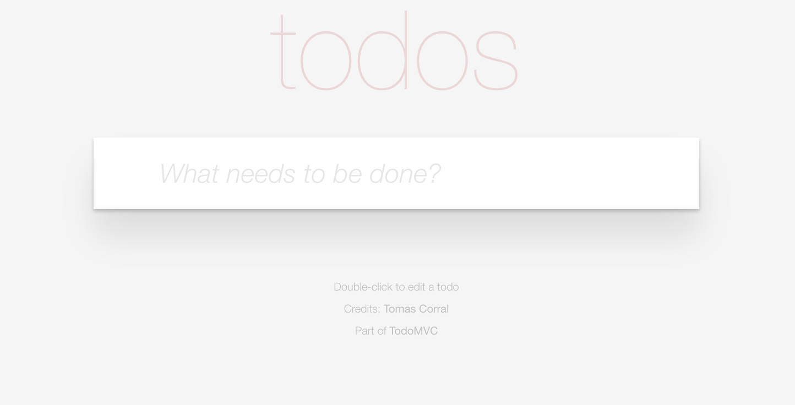

# Widget Extension

Hi, if you have landed in this page is because you want to be more productive improving the reusability of your code.

The idea of this widget extension is to create a widget that is totally blackboxed.

## How we have been working till now:
- Stuff that was packaged together with the widget:
	- Templates
	- Controllers
	- Directives used only in that widget.
	- Scaffolding Styles
- Stuff that was used as a module:
	- Services
	- Common Directives
- Module Dependencies are added in widget code.


## Issues of working till now:
- Is difficult to change the templates used in the widget.
- Controllers are blackboxed and can not be extended.
- Directives that were used only in one widget and that after some time are needed in a different widget ...
	- Best case:
		- It will require some refactoring.
			- Remove it from the widget.
			- Move that directive to an existing module or create a module just to keep it reusable.
	- Worst case:
		- It's just copied and pasted in the other widget.
- Scaffolding Styles never can be reused.
- If a new dependency is required, the widget code should be modified so it's never blackboxed.

```
Managing all that together requires do some changes in the way we work.
```

## What we want:
- Never again touch the code of widgets once they have been released.
- Make easier change/extend behaviour.
- Make easier change/extend view.
- See at one sight what are the dependencies of my widget.
- Do it as framework agnostic as possible.

## How we want to do that:
- Dependencies are setup in the model.xml.
- Main module and templates are setup in the model.xml.
- Use modules to store:
	- Behaviour - JS files
	- View - HTML files
	- Styles - CSS files
- Changing the used module allows to change easily from AngularJS to a different framework with too much effort.
	
### Base Widget:
Base widget is pretty much a simple widget but with the responsability of:

- Fetching the dependencies.
- Setup the main template.
- Instanciate the module.

### Base Widget NG:
Base widget NG is the Angular implementation to start the widgets automatically.

### Widget Main:
Widget Main is the widget that all the rest of widgets will extend from.

#### Blackboxed widget:
Widget Main can be considered blackboxed because:
- The code of Widget Main never will require to be modified because there is no logic, view or style in it.
- Uses the facade pattern to manage all the dependencies and change the behaviour and presentation.

* Input:
    * The model.xml contains what are the required dependencies for behaviour and presentation.
        * Component modules
        * Behaviour modules
        * Model modules
        * Presentation.
* Output:
    * A functional widget.
    * More preferences if needed in the editor.
    * Manage/Modify permissions of availability for preferences.

### Custom Widget:
What a custom widget requires:

- Widget main should be already imported.
- Create a model.xml and add the dependencies.
- Create a bower.json with the dependencies.
- Create a zip file containing both.
- Import that zip file in the portal.
	
	
### Widget Architecture Diagram:


For developing locally without portal:
---------------------------------------

### Get ready the environment.
1. To test the widgets locally you require to have a server running.
    - If you have a server running, just copy the test folder in the root of that server and open the url of your server in your favourite browser.
    - If you don't have any server running check [http-server](https://www.npmjs.com/package/http-server).
        - Execute ```http-server```
2. Open ```http://(server-domain)[:port]``
3. Open the console from your browser's developer tools to see messages.

### Open the main widget without any dependency.

```
Widget Main is a widget without any specific behaviour or view but with its own entity.
If it were an X-Men it would be Mystique.
```

1. Open ```http://(server-domain)[:port]/test/widget-main```
2. Check the console and you will see an error.


3. That error indicates that it requires to setup at least a main module and template.

### TODO simple widget.
1. Open the file ```test/widget-main/model.xml```in your favourite IDE.
2. Add the following lines of code before the **preferences** closing tag. 

```
<property name="dependency:module-todo-ui">
    <value type="string"/>
</property>
<property name="main:module">
    <value type="string">module-todo</value>
</property>
<property name="main:template">
    <value type="string">todo.html</value>
</property>
```

3. Those lines tell the widget to:
    - Load the following modules as dependencies:
        - module-todo-ui (simple dependency)
        - module-todo (main module)
    - Load the *todo.html* template from the main module
4. Refresh the page in the browser.
5. Eureka!! You already have the TODO widget running.

6. Check the HTML and you will see that is using a directive called *todo-tasks*

### Test the simple TODO widget.
1. Type the title of your task.

2. Press ENTER key.

3. Repeat steps 1 and 2 at least three times more.
4. Double click in one title to edit it.

5. Modify the title.

6. Press ENTER key.

7. Do/Undo clicking in the button before any title.

8. Move the mouse over any task to show the button to remove the task.

9. Remove any task clicking in the button after the title.


### Add more features extending the logic and changing the view.
1. Open the file ```test/widget-main/model.xml```in your favourite IDE.
2. Replace the lines added on creating the TODO simple widget by:

```
<property name="main:module">
    <value type="string">module-todo-extended</value>
</property>
<property name="main:template">
    <value type="string">todo.html</value>
</property>
```

3. Those lines tell the widget to:
    - Load the following module as dependencies: 
        - module-todo (main module)
    - Load the *todo.html* template from the main module
4. Refresh the page in the browser and see how the view of the widget has changed.


### Test the TODO widget extended.
1. Type the title of your task.

2. Press ENTER key.

3. Repeat steps 1 and 2 at least three times more.
4. Now you can also filter using those new links.

5. Click on them to see how the content is hidden or shown depending the status of the task.


6. Do the task clicking the button before the title while filtering by active tasks and see how it dissapears.
7. Click in the button that appears inside of the input to toggle all the tasks.

8. Mark as done one or more tasks 
9. Click in the *Clear Completed* link to see how they are removed from the list.




For developing using portal:
---------------------------------------

1. Run the portal.
2. Import all the modules that are stored inside of the dependencies folder using ```bb import-item``
    - base-widget
    - base-widget-ng
    - module-todo
    - module-todo-extended
    - module-todo-ui
    - widget-main

```
For testing purposes we have added the require config in the index.dev.html and in index.html.
The best practice should be to remove that from those files and add the dependencies in a custom require.js config.
If you don't have one already you should add it in the template your pages extend from.
```

3. Open the portal catalog.
4. Click in the *Import* button.
5. Click in the middle of that modal to open the file uploader.
6. Select the ```widget-todo/widget-todo.zip```
7. Click in the *Import* button.
8. Select the ```widget-todo-extended/widget-todo-extended.zip```
9. Open the editor of the portal
10. Drop those widgets in the same page.
11. See them running and enjoy them.

Bonus track:
---------------------------------------
Check the network tab in your developer tools and see what's different. ;)


Enjoy it!


Feedback to: amischol@gmail.com
